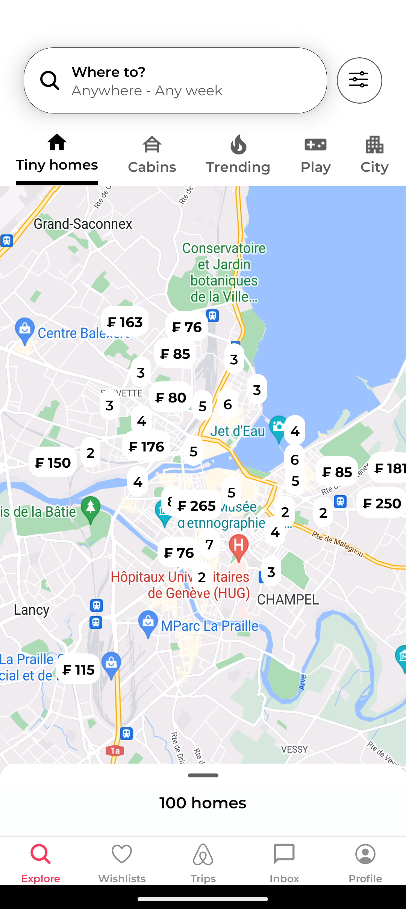
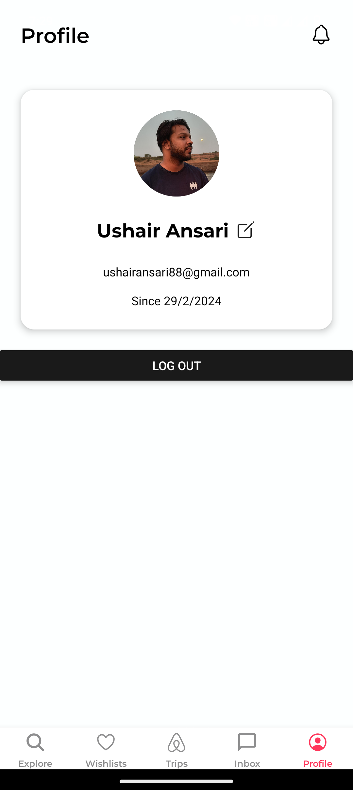
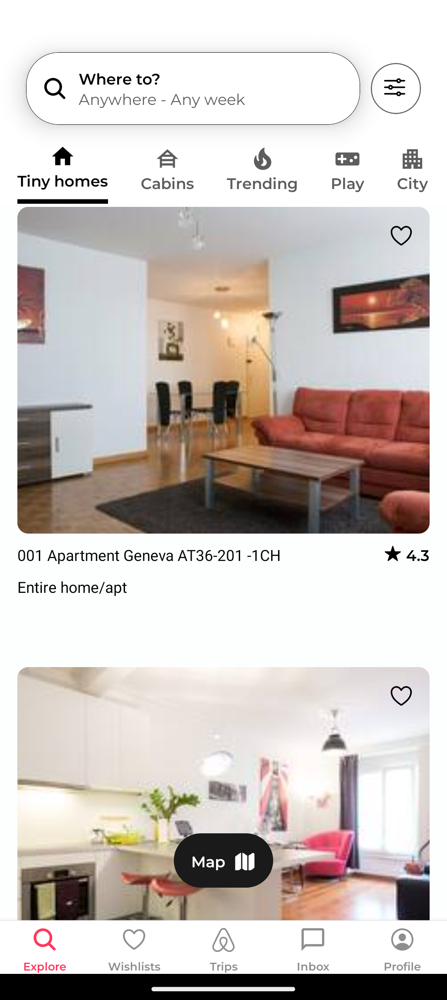
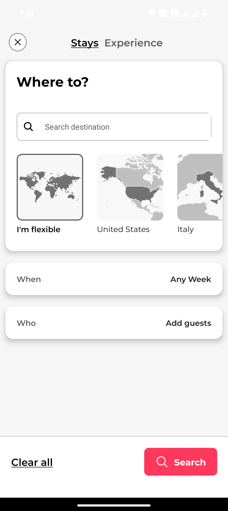
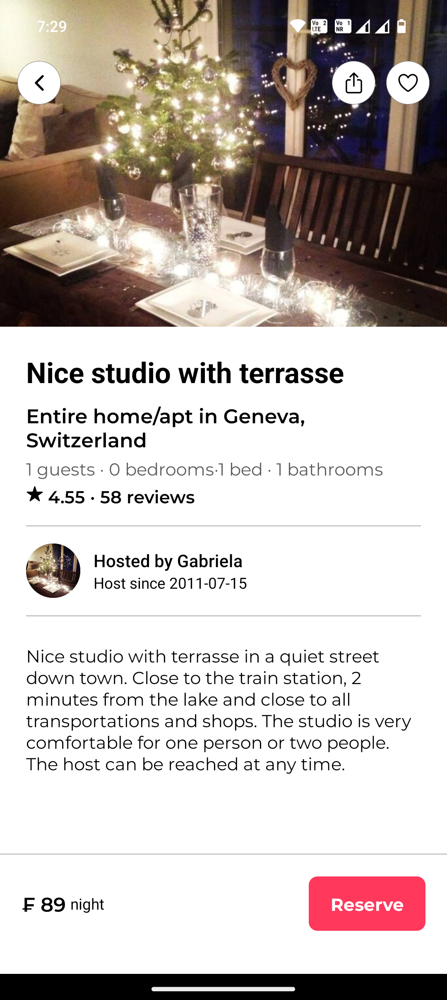

# Airbnb Clone React Expo App

Welcome to the Airbnb Clone React Expo App! This project is a React Native Expo application that aims to replicate the Airbnb user interface.

## Features

- Search for listings
- View detailed information about listings
- Filter listings based on various criteria
- Book listings

## Screenshots

 

## Installation

1. Clone the repository.
2. Navigate to the project directory.
3. Install dependencies using `npm install` or `yarn install`.
4. Run the application using `expo start`.

## Technologies Used

- React Native
- Expo
- Typescript
- Reanimated
- Clerk
- Maps.

## Acknowledgements

This project was created with the help of [Expo](https://expo.io/) and other open-source libraries.

## License

This project is licensed under the MIT License.
